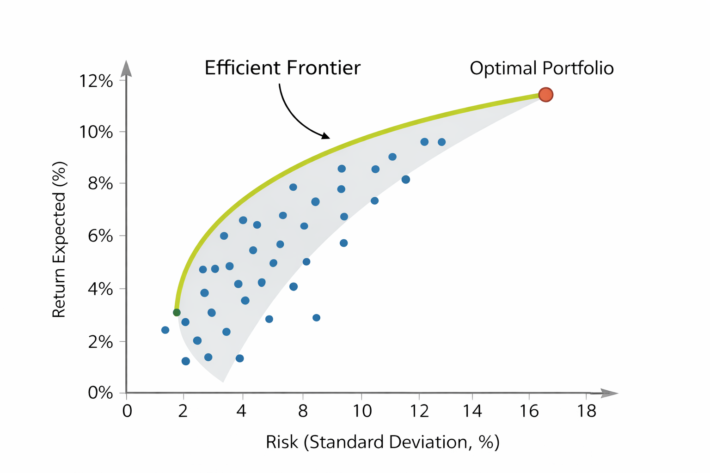

# Optimización de Portafolios de Inversión

Este documento presenta las principales metodologías para optimización de portafolios de inversión, con implementaciones prácticas en Python.

## Tabla de Contenidos

1. [Teoría Moderna de Portafolios (Markowitz)](#1-teoría-moderna-de-portafolios-markowitz)
2. [Modelo Black-Litterman](#2-modelo-black-litterman)
3. [Risk Parity](#3-risk-parity)
4. [Minimum Variance Portfolio](#4-minimum-variance-portfolio)
5. [Maximum Sharpe Ratio](#5-maximum-sharpe-ratio)
6. [Hierarchical Risk Parity (HRP)](#6-hierarchical-risk-parity-hrp)
7. [Estrategias Activas contra Benchmark](#7-estrategias-activas-contra-benchmark)
8. [Backtesting y Evaluación](#8-backtesting-y-evaluación)

---

## Librerías Necesarias

```python
import numpy as np # arrays y operaciones matemáticas
import pandas as pd # manejo de datos
import yfinance as yf # descarga de datos financieros
from scipy.optimize import minimize # optimización
from scipy.cluster.hierarchy import linkage, dendrogram # clustering jerárquico
from sklearn.covariance import LedoitWolf # estimación robusta de covarianza
import matplotlib.pyplot as plt # visualización
import seaborn as sns # visualización avanzada

```


## 1. Teoría Moderna de Portafolios (Markowitz)

### Metodología

La teoría moderna de portafolios, desarrollada por Harry Markowitz (1952), es el marco conceptual que explica cómo combinar activos para obtener la mejor relación posible entre retorno y riesgo, entendiendo el riesgo no de forma aislada, sino a nivel de portafolio.

La idea central del modelo es que no importa solo cuánto rinde un activo ni cuán riesgoso es por sí solo, sino cómo se comporta en conjunto con los demás activos del portafolio. Dos activos riesgosos pueden, al combinarse, reducir el riesgo total si no se mueven exactamente igual. A esta propiedad se le llama diversificación.


**Conceptos Fundamentales:**

1. **Retorno Esperado del Portafolio:**

    $$\mu_p = \sum_{i=1}^{n} w_i \mu_i$$
    
    Donde:
    - $\mu_p$ = retorno esperado del portafolio completo
    - $w_i$ = peso o proporción del activo $i$ en el portafolio (por ejemplo, 0.3 = 30%)
    - $\mu_i$ = retorno esperado del activo $i$
    - $n$ = número total de activos

    
    **Ejemplo simple:** Si tienes 40% en acción A (retorno 10%) y 60% en acción B (retorno 8%), entonces:
    $\mu_p = 0.4 \times 0.10 + 0.6 \times 0.08 = 0.088 = 8.8\%$

2. **Riesgo del Portafolio (Varianza):**
    $$\sigma_p^2 = w^T \Sigma w$$
    
    Donde:
    - $\sigma_p^2$ = varianza del portafolio (medida de riesgo)
    - $w$ = vector de pesos
    - $w^T$ = vector de pesos transpuesto
    - $\Sigma$ = matriz de covarianza (tabla de todas las covarianzas entre activos)
    - Cuando $i=j$, $\sigma_{ii}$ es la varianza del activo $i$
    
    **Volatilidad del portafolio:** $\sigma_p = \sqrt{\sigma_p^2}$ (desviación estándar)
    
    **Nota importante:** La varianza del portafolio NO es simplemente el promedio ponderado de las varianzas individuales. Las correlaciones entre activos reducen el riesgo total (beneficio de la diversificación).

3. **Diversificación:**
    El riesgo total se descompone en:
    - **Riesgo sistemático (de mercado)**: Afecta a todos los activos (recesiones, inflación). No se puede eliminar diversificando.
    - **Riesgo idiosincrático (específico)**: Afecta solo a un activo o sector. Se puede reducir diversificando.
    4. **Frontera Eficiente:**

        La frontera eficiente es el conjunto de todos los portafolios óptimos que ofrecen el máximo retorno esperado para cada nivel de riesgo, o el mínimo riesgo para cada nivel de retorno deseado.

        
        
        **¿Qué significa?**
        - El eje X es el riesgo (volatilidad) y el eje Y es el retorno esperado
        - Cada punto representa un portafolio posible con diferentes combinaciones de pesos
        - La frontera eficiente es la curva que une los mejores portafolios posibles
        - Cualquier portafolio por debajo de esta curva es subóptimo (existe otro con más retorno para el mismo riesgo, o menos riesgo para el mismo retorno)
        
        
        **Portafolios clave en la frontera:**
        - **Portafolio de Mínima Varianza Global (GMV)**: El punto más a la izquierda, con el menor riesgo posible
        - **Portafolio Tangente**: El punto con el mejor ratio de Sharpe (retorno por unidad de riesgo)
        
        **Teorema de los Dos Fondos:** Cualquier portafolio en la frontera eficiente puede construirse como una combinación lineal de dos portafolios cualesquiera sobre la frontera.

---

## 2. Modelo Black-Litterman

## 3. Risk Parity

## 4. Minimum Variance Portfolio

## 5. Maximum Sharpe Ratio

## 6. Hierarchical Risk Parity (HRP)

## 7. Estrategias Activas contra Benchmark

## 8. Backtesting y Evaluación

