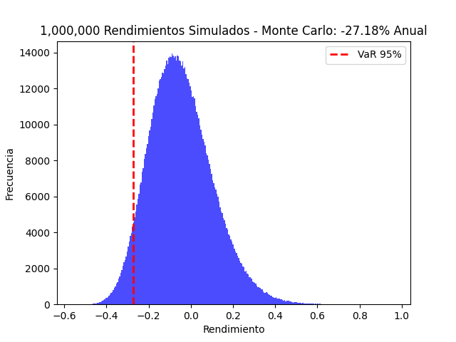
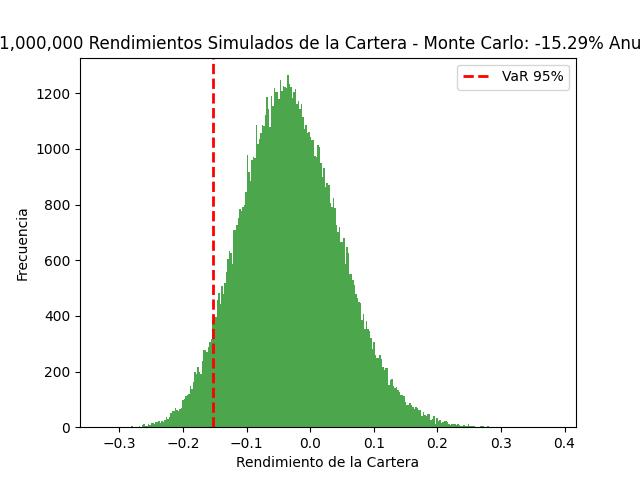

<div align="center">

# 📊 Gestión de Riesgo de Mercado

</div>

<br>

## Definición del Riesgo de Mercado

El **riesgo de mercado** se refiere a la posibilidad de que el valor de una inversión disminuya debido a cambios en las condiciones del mercado financiero. Este tipo de riesgo es **sistemático** y afecta a todos los activos financieros, incluyendo:

- **Acciones** - Riesgo de precio y volatilidad
- **Bonos** - Riesgo de tasa de interés y crédito  
- **Divisas** - Riesgo cambiario
- **Derivados** - Riesgo de subyacente y volatilidad

<br>

### Factores Determinantes

| Factor | Descripción | Impacto |
|--------|-------------|----------|
| **Tasas de Interés** | Fluctuaciones en política monetaria | Alto |
| **Precios de Activos** | Movimientos del mercado | Directo |
| **Volatilidad** | Incertidumbre e inestabilidad | Variable |
| **Eventos Macro** | Políticos, económicos, geopolíticos | Sistémico |

<br>

## Métricas Fundamentales de Riesgo de Mercado

Para **cuantificar el riesgo de mercado**, se utilizan diversas métricas estadísticas y financieras. La siguiente taxonomía presenta las principales medidas utilizadas en la industria financiera:

### **Métricas de Volatilidad y Dispersión**

**<u>Volatilidad</u>**


**Definición**: Mide la variabilidad de los rendimientos de un activo financiero mediante la desviación estándar de los rendimientos históricos.

**Interpretación**: Una mayor volatilidad indica mayor riesgo, ya que los precios pueden fluctuar significativamente en períodos cortos.


**<u>Value at Risk (VaR)</u>**

**Definición**: Medida estadística que estima la pérdida máxima potencial de una cartera durante un período específico con un nivel de confianza determinado.

**Ejemplo**: VaR del 95% a un día = Peor perdida que puede tener la cartera con una confianza del 95%.

**Métodos de Cálculo**:
- Paramétrico (distribución normal).
- Simulación histórica.
- Simulación Monte Carlo.

**<u>Tracking Error</u>**

**Definición**: Desviación estándar de las diferencias entre los rendimientos de una cartera y su índice de referencia.

**Utilidad**: Evaluar el desempeño relativo vs benchmark. Menor Tracking Error indica mayor similitud comportamental.

**Tipos**:
- **Ex-post**: Basado en datos históricos
- **Ex-ante**: Estimación prospectiva

<br>

### **Métricas de Sensibilidad al Mercado**

**<u>Beta de Mercado</u>**

**Definición**: Sensibilidad de los rendimientos de un activo en relación con los rendimientos del mercado.

**Interpretación**:
- β > 1: Activo más volátil que el mercado
- β < 1: Activo menos volátil que el mercado
- β = 1: Misma volatilidad que el mercado

**Aplicación**: Evaluación del riesgo sistemático en el marco del modelo CAPM.

### **Ratios de Rendimiento Ajustado por Riesgo**

| Ratio | Fórmula | Enfoque | Utilidad |
|-------|---------|---------|----------|
| **Sharpe** | $\frac{R_p - R_f}{\sigma_p}$ | Volatilidad total | Rendimiento por unidad de riesgo total |
| **Sortino** | $\frac{R_p - R_f}{\sigma_{downside}}$ | Volatilidad negativa | Rendimiento por unidad de riesgo a la baja |
| **Treynor** | $\frac{R_p - R_f}{\beta_p}$ | Riesgo sistemático | Rendimiento por unidad de riesgo de mercado |

Donde:
- $R_p$: Rendimiento de la cartera
- $R_f$: Tasa libre de riesgo  
- $\sigma_p$: Desviación estándar de la cartera
- $\sigma_{downside}$: Desviación estándar de rendimientos negativos
- $\beta_p$: Beta de la cartera

<br>

## Implementación Cuantitativa en Python

Esta sección presenta **implementaciones prácticas** de las métricas de riesgo utilizando Python y sus principales librerías para computación científica y análisis financiero.

### **Prerrequisitos Técnicos**

```python
# Librerías requeridas
import numpy as np           # Computación numérica
import pandas as pd          # Manipulación de datos
from scipy import stats      # Estadística avanzada
import matplotlib.pyplot as plt  # Visualización de datos
```

---

### **1. Cálculo de Volatilidad**
La **volatilidad** es una medida estadística que cuantifica la dispersión de los rendimientos de un activo financiero. Se calcula comúnmente como la desviación estándar de los retornos históricos.

**Interpretación Práctica:**
- Mayor volatilidad → Mayor riesgo → Fluctuaciones de precio más amplias
- Menor volatilidad → Menor riesgo → Movimientos de precio más estables


#### **1.1 Volatilidad de Activo Individual**

> **Método**: Desviación estándar de rendimientos históricos

La fórmula de la desviación estándar es:

$$\sigma = \sqrt{\frac{1}{N-1} \sum_{i=1}^{N} (r_i - \bar{r})^2}$$

Donde:
- $\sigma$: Desviación estándar (volatilidad)
- $N$: Número de observaciones
- $r_i$: Retorno en el período i
- $\bar{r}$: Retorno promedio

A continuación, se muestra un ejemplo de cómo calcular la volatilidad de un activo individual utilizando Python:

```python
import numpy as np
import pandas as pd

# Configuración de simulación
np.random.seed(42)

# 3 años de retornos diarios (año bursátil típico = 252 días)
days = 252 * 3  
returns = np.random.normal(0, 0.01, days)
returns_series = pd.Series(returns, name='RETORNS_DIARIOS')

# Cálculo de desviación estándar utlilizando pandas
volatility = returns_series.std() * np.sqrt(252)
print(f'📊 Volatilidad anualizada: {volatility:.2%}')
```
**Output esperado**: `📊 Volatilidad anualizada: 15.69%`

Como se ve en el ejemplo anterior, la volatilidad calculada con retornos diarios se puede anualizar multiplicándola por la raíz cuadrada del número de períodos en un año (252 días para datos diarios).

Lo anterior se explica porque la varianza de los retornos se escala linealmente con el tiempo, y la desviación estándar (volatilidad), al ser la raiz cuadrada de la varianza, se escala con la raíz cuadrada del tiempo.

Esta característica de la forma de escalar la desviación estandar, se aplica en otras métricas que involucran volatilidad, como el Value at Risk (VaR) y el Tracking Error.

#### **1.2 Volatilidad de Cartera Multi-Activo**

> **Método**: Matriz de varianza-covarianza

Para obtener la desviación estándar de la cartera, primero es necesario calcular su varianza total. Para comprender este cálculo, es fundamental entender la propiedad de la suma de varianzas.

Para dos variables aleatorias $X$ y $Y$:
$$\text{Var}(X + Y) = \text{Var}(X) + \text{Var}(Y) + 2 \cdot \text{Cov}(X, Y)$$

Para tres variables aleatorias $X$, $Y$ y $Z$:
$$\text{Var}(X + Y + Z) = \text{Var}(X) + \text{Var}(Y) + \text{Var}(Z) + 2 \cdot \text{Cov}(X, Y) + 2 \cdot \text{Cov}(X, Z) + 2 \cdot \text{Cov}(Y, Z)$$

**Observación Clave**: La varianza de la suma de variables aleatorias no es simplemente la suma de las varianzas individuales. Es necesario incorporar la covarianza entre cada par de variables, lo que captura cómo se mueven conjuntamente los activos.

En una cartera compuesta por $n$ activos, la varianza total se calcula considerando:
- Las varianzas individuales de cada activo
- Las covarianzas entre todos los pares de activos
- Los pesos de cada activo en la cartera

Este cálculo se realiza mediante la siguiente fórmula matricial:

$$
\sigma_p^2 =
\begin{bmatrix}
w_a & w_b & w_c & \dots & w_n
\end{bmatrix}  
\cdot
\begin{bmatrix}
var_a & cov_{a,b} & cov_{a,c} & \dots & cov_{a,n}\\
cov_{b,a} & var_b & cov_{b,c}  & \dots & cov_{b,n} \\
cov_{c,a} & cov_{c,b} & var_c  & \dots & cov_{c,n} \\
\vdots & \vdots & \vdots  & \dots &  \vdots \\
cov_{n,a} & cov_{n,b} & cov_{n,c}  & \dots & cov_{n,n}
\end{bmatrix}
\cdot
\begin{bmatrix}
w_a \\
w_b \\
w_c \\
\vdots \\
w_n
\end{bmatrix}
$$

Lo anterior se puede resumir de la siguiente manera:

$$\sigma_p^2 = w^T \cdot \Sigma \cdot w$$

$$ \sigma = \sqrt{w^T \cdot \Sigma \cdot w}$$

Donde:

- $\sigma_p$: Desviación estandar (volatilidad) de la cartera.
- $w$: Vector de pesos de la cartera.
- $w^T$: Vector de pesos de la cartera transpuesto.
- $\Sigma$: Matriz de varianza-covarianza de los activos.

A continuación, se muestra un ejemplo de cómo calcular la volatilidad de una cartera multi-activo utilizando Python:

```python
import numpy as np
import pandas as pd

# Configuración de simulación
np.random.seed(42)

# Simulación de cartera para 3 años de retornos diarios (año bursátil típico = 252 días)
days = 252 * 3  
num_assets = 4
returns_matrix = np.random.normal(0, 0.01, (days, num_assets))
returns_df = pd.DataFrame(returns_matrix, 
                         columns=[f'Asset_{i+1}' for i in range(num_assets)])

# Configuración de cartera equiponderada
weights = np.array([0.25, 0.25, 0.25, 0.25])  # Pesos iguales

# Matriz de varianza-covarianza
cov_matrix = returns_df.cov() 

# Cálculo de volatilidad de cartera: σ_p = √(w^T Σ w)
portfolio_volatility = np.sqrt(np.dot(weights.T, np.dot(cov_matrix.values, weights)))
portfolio_volatility_annualized = portfolio_volatility * np.sqrt(252)

print(f'📈 Volatilidad anual de la cartera: {portfolio_volatility_annualized:.2%}')
```

**Output esperado**: `📈 Volatilidad anual de la cartera: 7.84%`

---

#### **1.3 Método EWMA (Exponentially Weighted Moving Average)**

>**Definición**: Modelo que asigna mayor peso a los datos más recientes para estimar la volatilidad, utilizando un factor de decaimiento $\lambda$.

**Ventajas del Método EWMA**:
- **Adaptabilidad**: Se ajusta más rápidamente a cambios recientes en la volatilidad del mercado
- **Ponderación temporal**: Otorga mayor importancia a observaciones recientes, reflejando mejor la dinámica actual
- **Suavizado**: Reduce el ruido de fluctuaciones aleatorias mientras captura tendencias persistentes

**Limitaciones**:
- **Sensibilidad al parámetro λ**: La elección del factor de decaimiento es crítica y puede variar según el activo
- **Valores típicos**: En la práctica, RiskMetrics recomienda λ = 0.94 para datos diarios y λ = 0.97 para datos mensuales
- **Dependencia del histórico**: Requiere un valor inicial de varianza que puede afectar los primeros cálculos

**Comparación EWMA vs Volatilidad Tradicional**:

| Aspecto | Volatilidad Tradicional | EWMA |
|---------|------------------------|------|
| **Ponderación** | Igual peso para todas las observaciones | Mayor peso a datos recientes |
| **Respuesta** | Lenta ante cambios de mercado | Rápida adaptación |
| **Ventana temporal** | Fija (ej: 252 días) | Decaimiento exponencial |
| **Uso recomendado** | Análisis histórico estable | Gestión de riesgo dinámica |


**Fórmula**: $\sigma_t^2 = \lambda \sigma_{t-1}^2 + (1 - \lambda) r_{t-1}^2$

Donde:
- $\sigma_t^2$: Varianza en el tiempo t
- $\sigma_{t-1}^2$: Varianza en el tiempo t-1
- $r_{t-1}$: Rendimiento en el tiempo t-1
- $\lambda$: Factor de decaimiento (0 < λ < 1)


##### **EWMA para Activo Individual**

A continuación, se muestra un ejemplo con python de cómo calcular la volatilidad utilizando el método EWMA para un activo individual:

```python
import numpy as np
import pandas as pd
    
# Simulación de cartera para 3 años de retornos diarios (año bursátil típico = 252 días)
np.random.seed(42)
days = 252 * 3  
returns = np.random.normal(0, 0.01, days)
returns_df = pd.DataFrame(
    {
        'FECHA': pd.date_range(start='2020-01-01', periods=days, freq='B'),
        'RETORNS_DIARIOS': returns
    }
)
# Parámetro de decaimiento
lambda_ = 0.94

# Selección de datos hasta el penúltimo día
date = returns_df.sort_values(by='FECHA', ascending=True)['FECHA'].iloc[-2]
returns_date = returns_df[returns_df['FECHA'] <= date]

# varianza inicial
var_0 = returns_date['RETORNS_DIARIOS'].var()

# retorno inicial
ret_0 = returns_date['RETORNS_DIARIOS'].iloc[-1]

# Cálculo de volatilidad EWMA
ewma_var = lambda_ * var_0 + (1 - lambda_) * ret_0**2
ewma_vol_annualized = np.sqrt(ewma_var) * np.sqrt(252)

print(f'📉 Volatilidad anualizada EWMA: {ewma_vol_annualized:.2%}')
```

**Output esperado**: `⚡ Volatilidad EWMA (último valor): 15.59%`

##### **EWMA para Cartera Multi-Activo**

>**Definición:** Matriz varianza-covarianza ajustada.

La volatilidad de la cartera con EWMA se calcula de la siguiente manera:

$$\sigma_p = \sqrt{w^T \Sigma_{ewma} w}$$

La diferencia con el método tradicional es que la matriz de covarianza es la que se ajusta utilizando el método EWMA:

$$\Sigma_{ewma} = \lambda \Sigma_{t-1} + (1 - \lambda) r_{t-1} r_{t-1}^T$$

Donde:
- $\lambda$: Factor de decaimiento (0 < λ < 1)
- $\Sigma_{t-1}$: Matriz de covarianza en el tiempo t-1
- $r_{t-1} r_{t-1}^T$: Es la matriz de varianzas y covarianzas instantánea del día t−1.

A continuación, se muestra un ejemplo con python de cómo calcular la volatilidad utilizando el método EWMA para una cartera multi-activo:

```python
import numpy as np
import pandas as pd

# Simulación de cartera para 3 años de retornos diarios (año bursátil típico = 252 días)
np.random.seed(42)
days = 252 * 3
num_assets = 4
returns_matrix = np.random.normal(0, 0.01, (days, num_assets))
returns_df = pd.DataFrame(returns_matrix, 
                         columns=[f'Asset_{i+1}' for i in range(num_assets)])
returns_df['FECHA'] = pd.date_range(start='2020-01-01', periods=days, freq='B') 

# Parámetro de decaimiento
lambda_ = 0.94

# Selección de datos hasta el penúltimo día
date = returns_df.sort_values(by='FECHA', ascending=True)['FECHA'].iloc[-2]
returns_date = returns_df[returns_df['FECHA'] <= date].drop(columns=['FECHA'])

# Matriz de covarianza inicial
cov_0 = returns_date.cov().values

# Vector de retornos del último día
ret_0 = returns_date.iloc[-1].values.reshape(-1, 1)

# Cálculo de matriz de covarianza EWMA
ewma_cov = lambda_ * cov_0 + (1 - lambda_) * (ret_0 @ ret_0.T)

# Pesos de la cartera (equiponderada)
weights = np.array([0.25, 0.25, 0.25, 0.25]) 

# Cálculo de volatilidad de cartera EWMA
ewma_portfolio_vol = np.sqrt(np.dot(weights.T, np.dot(ewma_cov, weights)))
ewma_portfolio_vol_annualized = ewma_portfolio_vol * np.sqrt(252)

print(f'📉 Volatilidad anualizada EWMA de la cartera: {ewma_portfolio_vol_annualized:.2%}')
```
**Output esperado**: `⚡ Volatilidad EWMA de la cartera (último valor): 8.66%`

<br>

---

### **2. Value at Risk (VaR)**

El **VaR** cuantifica la pérdida máxima esperada con un nivel de confianza específico, los más utilizados son 95% y 99%. Las metodologías más comunes para calcular el VaR incluyen el método paramétrico, histórico y simulación de Monte Carlo.

Si el VaR mensual al 95% es 2%, significa que la peor pérdida esperada en un mes, con una confianza del 95%, es del 2%.


#### **2.1 Método Paramétrico**

> **Método**: Basado en distribución normal  

**Características Principales**:

- **Basado en distribución normal**: Asume que los rendimientos siguen una distribución gaussiana
- **Cálculo algebraico**: Utiliza fórmulas matemáticas cerradas en lugar de simulaciones
- **Parámetros clave**: Requiere únicamente la media (μ) y desviación estándar (σ) de los rendimientos
- **Eficiencia computacional**: Cálculo rápido y directo mediante fórmulas estadísticas
- **Nivel de confianza**: Típicamente se utilizan niveles de 95% o 99%

**Ventajas método paramétrico**

- **Simplicidad**: Fácil de implementar y comprender conceptualmente
- **Velocidad**: Cálculo instantáneo sin necesidad de simulaciones iterativas
- **Requerimientos de datos**: Necesita menos datos históricos comparado con métodos no paramétricos
- **Interpretación directa**: Relación clara entre volatilidad y riesgo
- **Transparencia**: Los supuestos y cálculos son completamente visibles y auditables

**Limitaciones método paramétrico**

- **Supuesto de normalidad**: Los mercados financieros presentan colas pesadas (fat tails) y asimetría que la distribución normal no captura
- **Eventos extremos**: Subestima la probabilidad de pérdidas severas (cisnes negros)
- **Linealidad**: Asume relaciones lineales entre factores de riesgo y valores de cartera
- **No captura curtosis**: Ignora el exceso de curtosis presente en series financieras
- **Correlaciones estáticas**: No considera cambios en las correlaciones durante períodos de estrés
- **Inadecuado para derivados**: No es apropiado para instrumentos con perfiles de riesgo no lineales.

El VaR paramétrico asume que los rendimientos de los activos financieros siguen una distribución normal. Bajo esta suposición, el VaR se calcula utilizando la media y la desviación estándar de los rendimientos.

$$\text{VaR} = \mu + z_\alpha \cdot \sigma$$

Donde: 
-   $\mu$: Retorno medio.
-   $z_\alpha$: Estadistico Z correspondiente a 1 - nivel de confianza 
-   $\sigma$: Desviación estándar.

**VaR Paramétrico - Activo Individual**

A continuación, se muestra un ejemplo de cómo calcular el VaR paramétrico para un activo individual utilizando Python:

```python
import numpy as np
import pandas as pd
from scipy.stats import norm

# Configuración de simulación
np.random.seed(42)

# 3 años de retornos diarios (año bursátil típico = 252 días)
days = 252 * 3  
returns = np.random.normal(0, 0.01, days)
returns_series = pd.Series(returns, name='RETORNS_DIARIOS')

# Cálculo de VaR paramétrico al 95%
confidence_level = 0.95
mean_return = returns_series.mean()
volatility = returns_series.std()
z_score = norm.ppf(1 - confidence_level)
var_parametric = mean_return + z_score * volatility
var_parametric_monthly = var_parametric * np.sqrt(20)  # Mensualización
print(f'📉 VaR paramétrico al 95%: {var_parametric_monthly:.2%}')
```

**Output esperado**:
``
📊 VaR Paramétrico Mensualizado (95% confianza): -7.35%
``

##### **VaR Paramétrico - Cartera Multi-Activo**

> **Método**: Matriz de varianza-covarianza.

Para el cálculo del VaR paramétrico de una cartera multi-activo, se utiliza la misma fórmula que para un activo individual, pero reemplazando la volatilidad del activo por la volatilidad de la cartera.

A continuación, se muestra un ejemplo de cómo calcular el VaR paramétrico para una cartera multi-activo utilizando Python:  

```python
import numpy as np
import pandas as pd
from scipy.stats import norm

# Configuración de simulación
np.random.seed(42)

# Simulación de cartera para 3 años de retornos diarios (año bursátil típico = 252 días)
days = 252 * 3  
num_assets = 4
returns_matrix = np.random.normal(0, 0.01, (days, num_assets))
returns_df = pd.DataFrame(returns_matrix, 
                         columns=[f'Asset_{i+1}' for i in range(num_assets)])

# Configuración de cartera equiponderada
weights = np.array([0.25, 0.25, 0.25, 0.25])  # Pesos iguales

# Matriz de varianza-covarianza
cov_matrix = returns_df.cov() 

# Cálculo de volatilidad de cartera: σ_p = √(w^T Σ w)
portfolio_volatility = np.sqrt(np.dot(weights.T, np.dot(cov_matrix.values, weights)))

# Cálculo de VaR paramétrico al 95%
confidence_level = 0.95
mean_return = returns_df.mean().dot(weights) # retorno medio de la cartera
z_score = norm.ppf(1 - confidence_level)
var_parametric = mean_return + z_score * portfolio_volatility
var_parametric_monthly = var_parametric * np.sqrt(20)  # Mensualización
print(f'📉 VaR paramétrico Mensualizado de la cartera al 95%: {var_parametric_monthly:.2%}')
```

**Output esperado**: `📈 VaR paramétrico Mensualizado de la cartera al 95%: -3.50%`


En ambos ejercicios anteriores, se puede ajustar el cálculo ultilizando EWMA, en el caso de un activo individual, se utiliza la volatilidad EWMA en lugar de la desviación estándar tradicional. Para una cartera multi-activo, se utiliza la matriz de covarianza EWMA.

#### **2.2 Método Histórico**

> **Método**: Estimación basada en rendimientos históricos ordenados


El VaR histórico es uno de los métodos más intuitivos para estimar el riesgo de mercado, ya que utiliza directamente los datos observados sin hacer supuestos paramétricos sobre la distribución de los rendimientos.

**Características Principales**:
- **Simplicidad conceptual**: Se basa únicamente en datos históricos reales
- **No paramétrico**: No asume ninguna distribución estadística específica (como normalidad)
- **Transparencia**: Fácil de explicar y entender para stakeholders no técnicos
- **Captura eventos extremos**: Incluye automáticamente crisis y eventos históricos significativos

**Ventajas del Método Histórico**:
1. **Refleja la realidad**: Utiliza datos reales del mercado, capturando comportamientos complejos
2. **Captura asimetría y curtosis**: No se ve limitado por supuestos de distribución normal
3. **Implementación sencilla**: Requiere solo ordenar los datos y seleccionar un percentil
4. **Incorpora correlaciones naturales**: En carteras, las correlaciones históricas están implícitas

**Limitaciones del Método Histórico**:
1. **Dependencia del período**: Los resultados pueden variar significativamente según el período histórico seleccionado
2. **Supuesto de estacionariedad**: Asume que el futuro se comportará como el pasado
3. **Eventos no observados**: No puede capturar eventos que no hayan ocurrido en el período histórico
4. **Requiere datos extensos**: Necesita un historial suficiente para estimaciones confiables (típicamente 250+ observaciones)
5. **Ventana temporal**: Puede ser menos reactivo a cambios recientes en la volatilidad del mercado


##### **VaR Histórico - Activo Individual**
```python
import numpy as np
import pandas as pd

# Simular rendimientos de un activo financiero
np.random.seed(42)
days = 252 * 3  # 3 años de datos diarios
returns = np.random.normal(0, 0.01, days)  # Rendimientos
returns_series = pd.Series(returns)

# Parámetros del VaR
confidence_level = 0.95

# Calcular el VaR histórico anualizado
var_historical = returns_series.quantile(1 - confidence_level) * np.sqrt(20)
print(f'📊 VaR histórico mensualizado (95%): {var_historical:.2%}')
```
**Output esperado**: `📊 VaR histórico mensualizado (95%): -7.19%`

##### **VaR Histórico - Cartera Multi-Activo**
Para el caso de una cartera de varios activos, se puede calcular el VaR histórico utilizando los rendimientos ponderados de la cartera:

```python
import numpy as np
import pandas as pd

# Simular rendimientos de 4 activos
num_assets = 4
returns_matrix = np.random.normal(0, 0.01, (days, num_assets))
returns_df = pd.DataFrame(returns_matrix, columns=[f'Asset_{i+1}' for i in range(num_assets)])  

# Pesos de la cartera
weights = np.array([0.25, 0.25, 0.25, 0.25])

# Calcular los rendimientos de la cartera
portfolio_returns = returns_df.dot(weights)

# Parámetros del VaR
confidence_level = 0.95

# Calcular el VaR histórico anualizado de la cartera
var_historical_portfolio = portfolio_returns.quantile(1 - confidence_level) * np.sqrt(20)
print(f'📈 VaR histórico mensualizado de la cartera (95%): {var_historical_portfolio:.2%}')
```

**Output esperado**: `📈 VaR histórico mensualizado de la cartera (95%): -3.39%`


#### **2.3 Método Simulación de Monte Carlo**
El VaR mediante simulación de Monte Carlo implica generar múltiples escenarios de rendimientos futuros. Para lo anterior, simulamos muchos futuros posibles usando un modelo matemático de cómo se mueven los precios: el Browniano Geométrico (GBM).

**Movimiento Browniano Geométrico**

El GBM es un modelo simple y popular en finanzas. Supone tres cosas clave:

1. Los retornos logarítmicos son normales
Esto significa que el retorno de un día sigue algo parecido a una campana (normal), lo cual es una aproximación simplificada, pero útil.

2. La volatilidad es constante en el tiempo
El riesgo de cada activo no cambia durante el horizonte simulado.

3. Los precios nunca caen bajo cero
Porque el modelo trabaja con exponenciales (lo cual es razonable).

La fórmula del GBM es:

$$ S_1 = S_0 \cdot e^{(\mu - \frac{1}{2}\sigma^2)\,\Delta t + \sigma \sqrt{\Delta t}\, Z} $$

Donde:
- $( S_1 )$ es el precio simulado al final del período.
- $( S_0 )$ es el precio inicial.
- $(\mu )$ es el retorno esperado (drift).
- $(\sigma )$ es la volatilidad del activo.
- $(\Delta t)$ es el tamaño del paso de tiempo (por ejemplo, 1 día = 1/252 años).
- $(Z)$ es una variable aleatoria normal estándar (media 0, desviación estándar 1).

Intuitivamente, el término $(\mu - \frac{1}{2}\sigma^2)\,\Delta t$ representa el crecimiento esperado ajustado por la volatilidad, mientras que el término $\sigma \sqrt{\Delta t}\, Z$ introduce la aleatoriedad en los precios.

Para simular múltiples trayectorias de precios futuros de un solo activo financiero, hay que seguir los siguientes pasos:

1. Calcular los parámetros necesarios: retorno esperado $(\mu)$ y volatilidad $(\sigma)$ a partir de los datos históricos.

2. Generar un número Z que provenga de una distribución normal estándar.

3. Aplicar la fórmula del GBM para obtener el precio simulado al final del período.

4. Repetir los pasos 2 y 3 para generar múltiples simulaciones.

A continuación, se muestra un ejemplo de cómo implementar la simulación de Monte Carlo para calcular el VaR de un activo financiero utilizando Python:
```python
import numpy as np
import pandas as pd
import matplotlib.pyplot as plt

# Simular rendimientos de un activo financiero
np.random.seed(42)
days = 252 * 3  # 3 años de datos diarios
returns = np.random.normal(0, 0.01, days)  # Rendimientos
returns_series = pd.Series(returns) 

# Parámetros del activo
S0 = 100  # Precio inicial

# Retorno anualizado
mu = returns_series.mean() * 252  

# Volatilidad anualizada   
sigma = returns_series.std() * np.sqrt(252)  

# Simulación de Monte Carlo
num_simulations = 10000
time_horizon = 1  # 1 año
simulated_prices = []   
for i in range(num_simulations):
    Z = np.random.normal()
    S1 = S0 * np.exp((mu - 0.5 * sigma**2) * time_horizon + sigma * np.sqrt(time_horizon) * Z)
    simulated_prices.append(S1)
simulated_prices = np.array(simulated_prices)

# Calcular los rendimientos simulados
simulated_returns = (simulated_prices - S0) / S0

# Parámetros del VaR
confidence_level = 0.95

# Calcular el VaR mediante simulación de Monte Carlo anualizado
var_monte_carlo = np.percentile(simulated_returns, (1 - confidence_level) * 100)
print(f'🎲 VaR Monte Carlo anualizado (95%): {var_monte_carlo:.2%}')
```

Si queremos graficar las simulaciones de precios futuros, podemos agregar el siguiente código al final del bloque anterior:

```python
# histograma de los rendimientos simulados
plt.hist(simulated_returns, bins=300, alpha=0.7, color='blue')
plt.title(f'{num_simulations:,} Rendimientos Simulados - Monte Carlo: {var_monte_carlo:.2%} Anual')
plt.xlabel('Rendimiento')
plt.ylabel('Frecuencia')
plt.axvline(var_monte_carlo, color='red', linestyle='dashed', linewidth=2, label='VaR 95%')
plt.legend()
# guardar y mostrar el gráfico
plt.savefig(r'images/monte_carlo_var_distribution.png')
plt.show()
```


Al considerar una cartera de varios activos, hay que tener presente que los activos no se mueven de forma independiente, algunos suben juntos, otros se mueven en sentido contrario.

Para que las simulaciones sean realistas necesitamos que los shocks aleatorios $(z)$ de los activos estén correlacionados. Para lo anterior se utiliza la descomposición de Cholesky de la matriz de correlación de los activos, a partir de esta, se obtiene la matriz triangular inferior, la cual es la que se utliza para correlacionar los shocks aleatorios generados.

##### **Descomposición de Cholesky**
Imaginemos un portafolio de tres activos, del cual se puede calcular una matriz de correlación como la siguiente:

$$
\begin{bmatrix}
1 & 0.8 & 0.1 \\
0.8 & 1 & 0.2 \\
0.1 & 0.2 & 1
\end{bmatrix}
$$   

La descomposición de Cholesky consiste en descomponer esta matriz en el producto de una matriz triangular inferior y su transpuesta. 

$$
\begin{bmatrix}
1 & 0.8 & 0.1 \\
0.8 & 1 & 0.2 \\
0.1 & 0.2 & 1
\end{bmatrix} =
\begin{bmatrix}
1 & 0 & 0 \\
0.8 & 0.6 & 0 \\
0.1 & 0.18 & 0.98
\end{bmatrix}
\cdot
\begin{bmatrix}
1 & 0.8 & 0.1 \\
0 & 0.6 & 0.18 \\
0 & 0 & 0.98
\end{bmatrix}
$$

Lo anterior se resume como:

$$\Sigma  = L \cdot L^T $$

Donde $(L)$ es la matriz triangular inferior y $(\Sigma)$ es la matriz de correlación original.

Una vez obtenida la matriz $(L)$, se genera un vector de variables aleatorias normales estándar independientes $(z_1, z_2, ...,z_n)$. Donde el producto punto de la matriz $(L)$ y el vector de variables aleatorias independientes da como resultado un nuevo vector de variables aleatorias correlacionadas 


$$
Z =
\begin{bmatrix}
1 & 0 & 0 \\
0.8 & 0.6 & 0 \\
0.1 & 0.18 & 0.98
\end{bmatrix}
\cdot
\begin{bmatrix}
z_1 \\
z_2 \\
z_3
\end{bmatrix}
$$

Cada elemento del vector $(Z)$ representa un shock aleatorio correlacionado para cada activo en la cartera. Estos shocks se utilizan luego en la fórmula del Movimiento Browniano Geométrico para simular los precios futuros de cada activo, teniendo en cuenta la correlación entre ellos.

Así, la formula del GBM para cada activo $(i)$ en la cartera se ajusta de la siguiente manera:  

$$ S_{1,i} = S_{0,i} \cdot e^{(\mu_i - \frac{1}{2}\sigma_i^2)\,\Delta t + \sigma_i \sqrt{\Delta t}\, Z_i} $$

Donde:
- $( S_{1,i} )$ es el precio simulado del activo $(i)$ al final del período.
- $( S_{0,i} )$ es el precio inicial del activo $(i)$.
- $(\mu_i )$ es el retorno esperado del activo $(i)$.
- $(\sigma_i )$ es la volatilidad del activo $(i)$.
- $(Z_i)$ es el shock aleatorio correlacionado para el activo $(i)$.    

A continuación, se muestra un ejemplo de cómo implementar la simulación de Monte Carlo con descomposición de Cholesky para calcular el VaR de una cartera de varios activos utilizando Python:
```python
import numpy as np
import pandas as pd

# Simular rendimientos de 4 activos
num_assets = 4
returns_matrix = np.random.normal(0, 0.01, (days, num_assets))
returns_df = pd.DataFrame(returns_matrix, columns=[f'Asset_{i+1}' for i in range(num_assets)])

# Pesos de la cartera
weights = np.array([0.25, 0.25, 0.25, 0.25]) 

# Parámetros de los activos
S0 = np.array([100, 150, 200, 250])  
mu = returns_df.mean() * 252  
sigma = returns_df.std() * np.sqrt(252)

# Matriz de correlación y descomposición de Cholesky
correlation_matrix = returns_df.corr()
L = np.linalg.cholesky(correlation_matrix)

# Simulación de Monte Carlo con Cholesky
num_simulations = 100_000
time_horizon = 1  # 1 año
simulated_portfolio_returns = []   
for i in range(num_simulations):
    Z_independent = np.random.normal(size=num_assets)
    # Correlacionar los shocks
    Z_correlated = L @ Z_independent  
    S1 = S0 * np.exp((mu - 0.5 * sigma**2) * time_horizon + sigma * np.sqrt(time_horizon) * Z_correlated)   
    portfolio_return = np.dot(weights, (S1 - S0) / S0)
    simulated_portfolio_returns.append(portfolio_return)
simulated_portfolio_returns = np.array(simulated_portfolio_returns)     

# Parámetros del VaR
confidence_level = 0.95 

# Calcular el VaR mediante simulación de Monte Carlo para la cartera (anualizado)
var_monte_carlo_portfolio = np.percentile(simulated_portfolio_returns, (1 - confidence_level) * 100)
print(f'🎲 VaR Monte Carlo anualizado de la cartera (95%): {var_monte_carlo_portfolio:.2%}')
```
Si queremos graficar las simulaciones de rendimientos futuros de la cartera, podemos agregar el siguiente código al final del bloque anterior:

```python
# histograma de los rendimientos simulados de la cartera
plt.hist(simulated_portfolio_returns, bins=300, alpha=0.7, color='green')
plt.title(f'{num_simulations:,} Rendimientos Simulados de la Cartera - Monte Carlo: {var_monte_carlo_portfolio:.2%} Anual')
plt.xlabel('Rendimiento de la Cartera')
plt.ylabel('Frecuencia')        
plt.axvline(var_monte_carlo_portfolio, color='red', linestyle='dashed', linewidth=2, label='VaR 95%')
plt.legend()
# guardar y mostrar el gráfico
plt.savefig(r'images/monte_carlo_portfolio_var_distribution.png')
plt.show()
```


<br>

**Comparación con Otros Métodos de VaR**:

| Aspecto | VaR Histórico | VaR Paramétrico | VaR Monte Carlo |
|---------|--------------|-----------------|-----------------|
| **Supuestos** | Ninguno | Normalidad | Modelo estocástico |
| **Cálculo** | Simple | Muy rápido | Computacionalmente intensivo |
| **Colas pesadas** | Captura si existen | Subestima | Depende del modelo |
| **Datos requeridos** | Muchos | Moderados | Moderados + modelo |
| **Flexibilidad** | Baja | Baja | Alta |

<br>

---

### **3. Cálculo Tracking Error**
El Tracking Error mide la desviación estándar de las diferencias entre los rendimientos de una cartera y su índice de referencia (benchmark). Existen dos tipos principales de Tracking Error: Expost y Exante.

#### **3.1 Tracking Error Expost**
>**Método**: Basado en datos históricos de rendimientos pasados

El Tracking Error Expost mide la desviación estándar de las diferencias entre los rendimientos de una cartera y su índice de referencia durante un período pasado.

**Fórmula del Tracking Error Expost**:

$$TE_{expost} = \sigma(R_p - R_b)$$

Donde:
- $(R_p)$: Rendimiento de la cartera
- $(R_b)$: Rendimiento del benchmark
- $\sigma$: Desviación estándar de las diferencias de rendimiento

**Interpretación**: Un Tracking Error Expost del 3% anualizado significa que históricamente la cartera se ha desviado en promedio un 3% por año respecto al benchmark.

**Ejemplo de cálculo paso a paso**:

```python
import numpy as np  
import pandas as pd

# Simular rendimientos de 4 activos y su benchmark
np.random.seed(42)
days = 252 * 3
num_assets = 4  
returns_matrix = np.random.normal(0, 0.01, (days, num_assets))
returns_df = pd.DataFrame(returns_matrix, columns=[f'Asset_{i+1}' for i in range(num_assets)])  
benchmark_returns = np.random.normal(0, 0.008, days)  # Rendimientos del benchmark
benchmark_returns_series = pd.Series(benchmark_returns)

# Pesos de la cartera
weights = np.array([0.25, 0.25, 0.25, 0.25])

# Paso 1: Calcular los rendimientos de la cartera
portfolio_returns = returns_df.dot(weights) 

# Paso 2: Calcular las diferencias de rendimiento (R_p - R_b)
return_differences = portfolio_returns - benchmark_returns_series   

# Paso 3: Calcular la desviación estándar de las diferencias
tracking_error_daily = return_differences.std()

# Paso 4: Anualizar el Tracking Error (multiplicar por √252)
tracking_error_expost_portfolio = tracking_error_daily * np.sqrt(252)

print(f'📏 Tracking Error Ex-post (diario): {tracking_error_daily:.4%}')
print(f'📏 Tracking Error Ex-post (anualizado): {tracking_error_expost_portfolio:.2%}')
```
**Output esperado**: `📏 Tracking Error Ex-post (anualizado): 15.07%`


#### **3.2 Tracking Error Exante**
>**Método**: Basado en la matriz de covarianza de los activos en la cartera

El Tracking Error Exante estima la desviación estándar de las diferencias entre los rendimientos esperados de una cartera y su índice de referencia utilizando la matriz de covarianza de los activos en la cartera. 

El Tracking Error Ex-ante se calcula mediante la expresión matricial:

$$TE_{exante} = \sqrt{(w_p - w_b)^T \cdot \Sigma \cdot (w_p - w_b)}$$

Donde:
- $(w_p)$: Vector de pesos de la cartera activa
- $(w_b)$: Vector de pesos del benchmark
- $(w_p - w_b)$: Vector de pesos activos (active weights)
- $(\Sigma)$: Matriz de covarianza de los retornos de los activos

A continuación, se muestra un ejemplo de cómo calcular el Tracking Error Exante utilizando Python:

```python
import numpy as np
import pandas as pd

# Simular rendimientos de 4 activos
np.random.seed(42)
days = 252 * 3
num_assets = 4
returns_matrix = np.random.normal(0, 0.01, (days, num_assets))
returns_df = pd.DataFrame(returns_matrix, columns=[f'Asset_{i+1}' for i in range(num_assets)])

# Simular pesos del benchmark (índice de referencia)
benchmark_weights = np.array([0.30, 0.30, 0.25, 0.15])

# Pesos de la cartera activa
portfolio_weights = np.array([0.25, 0.25, 0.25, 0.25])

# Calcular el vector de diferencias de pesos activos (Active Weights)
active_weights = portfolio_weights - benchmark_weights

# Calcular la matriz de covarianza de los activos
cov_matrix = returns_df.cov()

# Calcular el Tracking Error Ex-ante
tracking_error_exante = np.sqrt(np.dot(active_weights.T, np.dot(cov_matrix.values, active_weights)))

# Anualizar el Tracking Error (multiplicar por √252 para datos diarios)
tracking_error_exante_annualized = tracking_error_exante * np.sqrt(252)

print(f'📏 Tracking Error Ex-ante (anualizado): {tracking_error_exante_annualized:.2%}')
```

**Output esperado**: `📏 Tracking Error Ex-ante (anualizado): 1.93%`

**Diferencias Clave entre Ex-ante y Ex-post**:

| Aspecto | Ex-post | Ex-ante |
|---------|---------|---------|
| **Base** | Retornos históricos realizados | Matriz de covarianza prospectiva |
| **Fórmula** | $TE = \sigma(R_p - R_b)$ | $TE = \sqrt{w_{activo}^T \Sigma w_{activo}}$ |
| **Uso** | Evaluación de desempeño pasado | Gestión de riesgo prospectiva |
| **Ventaja** | Refleja realidad histórica | Estimación adelantada del riesgo |
| **Limitación** | Backward-looking | Depende de supuestos de covarianza |

<br>

---

### **4. Cálculo Beta de Mercado**
El beta de mercado se calcula mediante la regresión lineal de los rendimientos de un activo o cartera contra los rendimientos del mercado, por métdo de los mínimos cuadrados ordinarios (OLS). A continuación, se muestra un ejemplo de cómo calcular el beta de mercado utilizando Python:

La siguiente fórmula representa la relación lineal entre los rendimientos del activo $(R_i)$ y los rendimientos del mercado $(R_m)$:    

$$ R_i = \alpha + \beta R_m + \epsilon $$

Donde:
- $(R_i)$ es el rendimiento del activo o cartera.
- $(R_m)$ es el rendimiento del mercado.
- $(\alpha)$ es la intersección de la regresión.
- $(\beta)$ es el coeficiente que mide la sensibilidad del activo o cartera a los
rendimientos del mercado.
- $(\epsilon)$ es el término de error.

Es esta relación lineal de la que inspira el modelo CAPM (Capital Asset Pricing Model), el cual establece que el rendimiento esperado de un activo o cartera está relacionado con su beta de la siguiente manera:

$$ E(R_i) = \alpha + \beta (E(R_m) - R_f) +  \epsilon  $$

Donde:
- $(E(R_i))$ es el rendimiento esperado del activo.
- $(E(R_m))$ es el rendimiento esperado del mercado.
- $(R_f)$ es la tasa libre de riesgo.
- $(\beta)$ es el riesgo sistemático del activo.
- $(\alpha)$ es el riesgo no sistemático del activo.
- $(\epsilon)$ retorno no explicado.

Cuando se genenera una cartera de activos financieros, a medida que esta se diversifica, el riesgo no sistemático $(\alpha)$ y el retorno no explicaco $(\epsilon)$ tiende a reducirse, dejando al beta $(\beta)$ como la principal medida del riesgo asociado a la cartera en relación con el mercado.

La formula principql para calcular el beta de mercado es:

$$ \beta = \frac{Cov(R_i, R_m)}{Var(R_m)} $$

Donde:
- $(Cov(R_i, R_m))$ es la covarianza entre los rendimientos
del activo o cartera y los rendimientos del mercado.
- $(Var(R_m))$ es la varianza de los rendimientos del mercado.


Otra forma de estimar el beta es:

$$ \beta = \rho_{i,m} \cdot \frac{\sigma_i}{\sigma_m} $$

Donde:
- $(\rho_{i,m})$ es el coeficiente de correlación entre los rendimientos del activo o cartera y los rendimientos del mercado.
- $(\sigma_i)$ es la desviación estándar de los rendimientos del activo o cartera
- $(\sigma_m)$ es la desviación estándar de los rendimientos del mercado.


Para calcular el beta de mercado de un activo financiero utilizando Python, se puede seguir el siguiente ejemplo:

```python
import numpy as np
import pandas as pd
from scipy.stats import linregress

# Simular rendimientos de un activo financiero y del mercado
np.random.seed(42)
days = 252 * 3  # 3 años de datos diarios
asset_returns = np.random.normal(0, 0.01, days)  # Rendimientos del activo
market_returns = np.random.normal(0, 0.008, days)  # Rendimientos del mercado
asset_returns_series = pd.Series(asset_returns)
market_returns_series = pd.Series(market_returns)

# Calcular el beta mediante regresión lineal
slope, intercept, r_value, p_value, std_err = linregress(market_returns_series, asset_returns_series)
beta = slope
print(f'🎯 Beta del activo: {beta:.4f}')
```

**Output esperado**: `🎯 Beta del activo: 0.0042`


Para el caso de una cartera de varios activos, se puede calcular el beta de mercado utilizando los rendimientos ponderados de la cartera:

```python
import numpy as np
import pandas as pd

# Simular rendimientos de 4 activos y del mercado
num_assets = 4
returns_matrix = np.random.normal(0, 0.01, (days, num_assets))
returns_df = pd.DataFrame(returns_matrix, columns=[f'Asset_{i+1}' for i in range(num_assets)])
market_returns = np.random.normal(0, 0.008, days)  # Rendimientos del mercado
market_returns_series = pd.Series(market_returns)

# Pesos de la cartera
weights = np.array([0.25, 0.25, 0.25, 0.25])

# Calcular los rendimientos de la cartera
portfolio_returns = returns_df.dot(weights)

# Calcular el beta de la cartera mediante regresión lineal
slope, intercept, r_value, p_value, std_err = linregress(market_returns_series, portfolio_returns)
beta_portfolio = slope
print(f'🃈 Beta de la cartera: {beta_portfolio:.4f}')
```

**Output esperado**: `🃈 Beta de la cartera: 0.0033`


### **5 Cálculo de Ratios**
#### **5.1 Ratio de Sharpe**

El Ratio de Sharpe es una métrica fundamental en finanzas que mide el exceso de rentabilidad por unidad de riesgo asumido. Fue desarrollado por el premio Nobel William F. Sharpe en 1966.

El Ratio de Sharpe se calcula mediante la siguiente fórmula:

$$Sharpe  = (R_p - R_f) / \sigma_p$$

Donde:
- $R_p$: Rentabilidad promedio del portafolio o activo
- $R_f$: Tasa libre de riesgo (risk-free rate)
- $\sigma_p$: Desviación estándar de los retornos del portafolio (volatilidad)

Interpretación del Ratio de Sharpe:

- **Sharpe > 1:** Considerado bueno. La inversión genera retornos superiores al riesgo asumido
- **Sharpe < 1:** La inversión puede no estar compensando adecuadamente el riesgo
- **Sharpe < 0:** Los retornos son inferiores a la tasa libre de riesgo

A continuación, se muestra un ejemplo de cómo calcular el Ratio de Sharpe utilizando Python:

```python
import numpy as np
import pandas as pd

# Simular rendimientos de un activo financiero
np.random.seed(42)
days = 252 * 3  # 3 años de datos diarios
returns = np.random.normal(0, 0.01, days)  # Rendimientos
returns_series = pd.Series(returns)

# Parámetros del Ratio de Sharpe
risk_free_rate = 0.01  # Tasa libre de riesgo anualizada    

# Calcular el exceso de retorno anualizado
excess_return = returns_series.mean() * 252 - risk_free_rate

# Calcular la volatilidad anualizada
volatility = returns_series.std() * np.sqrt(252)

# Calcular el Ratio de Sharpe
sharpe_ratio = excess_return / volatility
print(f'📈 Ratio de Sharpe: {sharpe_ratio:.4f}')
```

**Output esperado**: `📈 Ratio de Sharpe: -0.3596`


Para el caso de una cartera de varios activos, se puede calcular el Ratio de Sharpe utilizando los rendimientos ponderados de la cartera:

```python
import numpy as np
import pandas as pd

# Simular rendimientos de 4 activos
num_assets = 4
returns_matrix = np.random.normal(0, 0.01, (days, num_assets))
returns_df = pd.DataFrame(returns_matrix, columns=[f'Asset_{i+1}' for i in range(num_assets)])  

# Pesos de la cartera
weights = np.array([0.25, 0.25, 0.25, 0.25])

# Calcular los rendimientos de la cartera
portfolio_returns = returns_df.dot(weights)

# Parámetros del Ratio de Sharpe
risk_free_rate = 0.01  # Tasa libre de riesgo anualizada    

# Calcular el exceso de retorno anualizado de la cartera
excess_return_portfolio = portfolio_returns.mean() * 252 - risk_free_rate

# Calcular la volatilidad anualizada de la cartera
volatility_portfolio = portfolio_returns.std() * np.sqrt(252)

# Calcular el Ratio de Sharpe de la cartera
sharpe_ratio_portfolio = excess_return_portfolio / volatility_portfolio
print(f'📈 Ratio de Sharpe de la cartera: {sharpe_ratio_portfolio:.4f}')
```

**Output esperado**: `📈 Ratio de Sharpe de la cartera: 0.9530`


#### **5.2 Ratio de Sortino**

El Ratio de Sortino es una métrica de evaluación de rendimiento que mide el retorno ajustado por riesgo de una inversión, considerando únicamente la volatilidad negativa (downside risk) en lugar de la volatilidad total como lo hace el Ratio de Sharpe.

El Ratio de Sortino se calcula mediante la siguiente fórmula:

$$Sortino = (R_p - R_f) / \sigma_d$$

Donde:
- $R_p$: Retorno promedio de la cartera o activo
- $R_f$: Tasa libre de riesgo (risk-free rate) o retorno mínimo aceptable (MAR - Minimum Acceptable Return)
- $\sigma_d$: Desviación estándar de los retornos negativos (downside deviation)


**Características principales**:

- **Enfoque en pérdidas**: A diferencia del Ratio de Sharpe, solo penaliza la volatilidad negativa, considerando que la volatilidad al alza es deseable para los inversionistas.
- **Retorno mínimo aceptable**: Permite definir un umbral personalizado (MAR) en lugar de usar necesariamente la tasa libre de riesgo.
- **Interpretación**: Un ratio mayor indica mejor rendimiento ajustado por riesgo negativo. Valores superiores a 2 se consideran muy buenos, mientras que valores inferiores a 1 son cuestionables.

**Ventajas sobre el Ratio de Sharpe**:

1. Distingue entre volatilidad "buena" (ganancias) y "mala" (pérdidas)
2. Más apropiado para distribuciones asimétricas de retornos
3. Mejor para reflejar la aversión al riesgo de los inversionistas que se preocupan principalmente por las pérdidas.

A continuación, se muestra un ejemplo de cómo calcular el Ratio de Sortino utilizando Python:

```python
import numpy as np
import pandas as pd

# Simular rendimientos de un activo financiero
np.random.seed(42)
days = 252 * 3  # 3 años de datos diarios
returns = np.random.normal(0, 0.01, days)  # Rendimientos
returns_series = pd.Series(returns)

# Parámetros del Ratio de Sortino
risk_free_rate = 0.01  # Tasa libre de riesgo anualizada    

# Calcular el exceso de retorno anualizado
excess_return = returns_series.mean() * 252 - risk_free_rate

# Calcular la desviación estándar de los rendimientos negativos
downside_returns = returns_series[returns_series < 0]
downside_deviation = downside_returns.std() * np.sqrt(252)

# Calcular el Ratio de Sortino
sortino_ratio = excess_return / downside_deviation
print(f'📈 Ratio de Sortino: {sortino_ratio:.4f}')
```

**Output esperado**: `📈 Ratio de Sortino: -0.6203`


Para el caso de una cartera de varios activos, se puede calcular el Ratio de Sortino utilizando los rendimientos ponderados de la cartera:

```python
import numpy as np
import pandas as pd

# Simular rendimientos de 4 activos
num_assets = 4
returns_matrix = np.random.normal(0, 0.01, (days, num_assets))
returns_df = pd.DataFrame(returns_matrix, columns=[f'Asset_{i+1}' for i in range(num_assets)])  

# Pesos de la cartera
weights = np.array([0.25, 0.25, 0.25, 0.25])

# Calcular los rendimientos de la cartera
portfolio_returns = returns_df.dot(weights)

# Parámetros del Ratio de Sortino
risk_free_rate = 0.01  # Tasa libre de riesgo anualizada    

# Calcular el exceso de retorno anualizado de la cartera
excess_return_portfolio = portfolio_returns.mean() * 252 - risk_free_rate

# Calcular la desviación estándar de los rendimientos negativos de la cartera

downside_returns_portfolio = portfolio_returns[portfolio_returns < 0]
downside_deviation_portfolio = downside_returns_portfolio.std() * np.sqrt(252)  

# Calcular el Ratio de Sortino de la cartera
sortino_ratio_portfolio = excess_return_portfolio / downside_deviation_portfolio
print(f'📈 Ratio de Sortino de la cartera: {sortino_ratio_portfolio:.4f}')
```

**Output esperado**: `📈 Ratio de Sortino de la cartera: -2.4403`


#### **5.3 Ratio de Treynor**

El **Ratio de Treynor** (también conocido como índice de recompensa a volatilidad) es una métrica financiera que mide el exceso de rentabilidad obtenido por unidad de riesgo sistemático asumido. Este indicador es especialmente útil para evaluar el desempeño de carteras de inversión diversificadas.

El Ratio de Treynor se calcula mediante la siguiente fórmula:

$$Treynor = (R_p - R_f) / \beta_p$$

Donde:
- **Rp**: Rentabilidad de la cartera o activo
- **Rf**: Tasa libre de riesgo (risk-free rate)
- **βp**: Beta de la cartera, que mide la sensibilidad del activo respecto al mercado (riesgo sistemático)

**Características Principales**:

- **Enfoque en Riesgo Sistemático**: A diferencia del Ratio de Sharpe que utiliza la desviación estándar (riesgo total), el Ratio de Treynor utiliza Beta, que representa únicamente el riesgo sistemático o no diversificable.

- **Ideal para Carteras Diversificadas**: Es más apropiado para evaluar carteras bien diversificadas donde el riesgo no sistemático ha sido minimizado.

- **Interpretación**: Un ratio más alto indica mejor desempeño ajustado al riesgo. Valores positivos sugieren que la cartera supera la tasa libre de riesgo, mientras que valores negativos indican lo contrario.

**Ventajas**:

- Útil para comparar fondos o carteras dentro de un mismo mercado
- Considera solo el riesgo que no puede eliminarse mediante diversificación
- Permite evaluar la habilidad del gestor para generar rendimientos adicionales por cada unidad de riesgo de mercado asumido

**Limitaciones**:

- Requiere que la cartera esté adecuadamente diversificada
- Asume que Beta es una medida estable del riesgo, lo cual puede no ser cierto en períodos de alta volatilidad
- No es útil para comparar activos individuales con alto riesgo no sistemático

A continuación, se muestra un ejemplo de cómo calcular el Ratio de Treynor utilizando Python:

```python
import numpy as np
import pandas as pd
from scipy.stats import linregress

# Simular rendimientos de un activo financiero y del mercado
np.random.seed(42)
days = 252 * 3  # 3 años de datos diarios
asset_returns = np.random.normal(0, 0.01, days)  # Rendimientos del activo
market_returns = np.random.normal(0, 0.008, days)  # Rendimientos del mercado
asset_returns_series = pd.Series(asset_returns)
market_returns_series = pd.Series(market_returns)

# Calcular el beta mediante regresión lineal
slope, intercept, r_value, p_value, std_err = linregress(market_returns_series, asset_returns_series)
beta = slope    

# Parámetros del Ratio de Treynor
risk_free_rate = 0.01  # Tasa libre de riesgo anualizada    

# Calcular el exceso de retorno anualizado
excess_return = asset_returns_series.mean() * 252 - risk_free_rate

# Calcular el Ratio de Treynor
treynor_ratio = excess_return / beta
print(f'📈 Ratio de Treynor: {treynor_ratio:.4f}')
```

**Output esperado**: `📈 Ratio de Treynor: -0.2907`

Para el caso de una cartera de varios activos, se puede calcular el Ratio de Treynor utilizando los rendimientos ponderados de la cartera:

```python
import numpy as np
import pandas as pd
from scipy.stats import linregress

# Simular rendimientos de 4 activos y del mercado
num_assets = 4
returns_matrix = np.random.normal(0, 0.01, (days, num_assets))
returns_df = pd.DataFrame(returns_matrix, columns=[f'Asset_{i+1}' for i in range(num_assets)])
market_returns = np.random.normal(0, 0.008, days)  # Rendimientos del mercado
market_returns_series = pd.Series(market_returns)

# Pesos de la cartera
weights = np.array([0.25, 0.25, 0.25, 0.25])

# Calcular los rendimientos de la cartera
portfolio_returns = returns_df.dot(weights)

# Calcular el beta de la cartera mediante regresión lineal
slope, intercept, r_value, p_value, std_err = linregress(market_returns_series, portfolio_returns)
beta_portfolio = slope  

# Parámetros del Ratio de Treynor
risk_free_rate = 0.01  # Tasa libre de riesgo anualizada

# Calcular el exceso de retorno anualizado de la cartera
excess_return_portfolio = portfolio_returns.mean() * 252 - risk_free_rate   

# Calcular el Ratio de Treynor de la cartera
treynor_ratio_portfolio = excess_return_portfolio / beta_portfolio
print(f'📈 Ratio de Treynor de la cartera: {treynor_ratio_portfolio:.4f}')
```

**Output esperado**: `📈 Ratio de Treynor de la cartera: 3.3323`

---

<br>

## **Resumen de Métricas Implementadas**

### **Tabla Comparativa de Métricas de Riesgo**

| Métrica | Tipo | Fórmula | Interpretación | Ventajas | Limitaciones |
|---------|------|---------|----------------|----------|-------------|
| **Volatilidad** | Dispersión | $\sigma = \sqrt{\text{Var}(R)}$ | Mayor valor = mayor riesgo | Simple, intuitiva | No captura direccionalidad |
| **VaR** | Pérdida máxima | $P(L > \text{VaR}) = \alpha$ | Pérdida con probabilidad α | Regulatorio, comparable | No informa sobre colas |
| **Beta** | Sensibilidad | $\beta = \frac{\text{Cov}(R_i, R_m)}{\text{Var}(R_m)}$ | Riesgo sistemático | Relación con mercado | Solo riesgo sistemático |
| **Sharpe** | Eficiencia | $\frac{R_p - R_f}{\sigma_p}$ | Rendimiento/riesgo | Ajuste por riesgo total | Asume normalidad |
| **Sortino** | Eficiencia | $\frac{R_p - R_f}{\sigma_{\text{downside}}}$ | Penaliza solo volatilidad negativa | Enfoque en pérdidas | Requiere más datos |
| **Treynor** | Eficiencia | $\frac{R_p - R_f}{\beta_p}$ | Rendimiento/riesgo sistemático | Ajuste por riesgo de mercado | Ignora riesgo específico |

